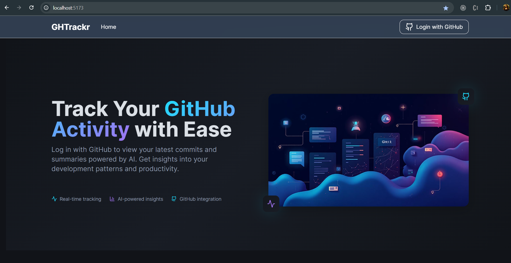
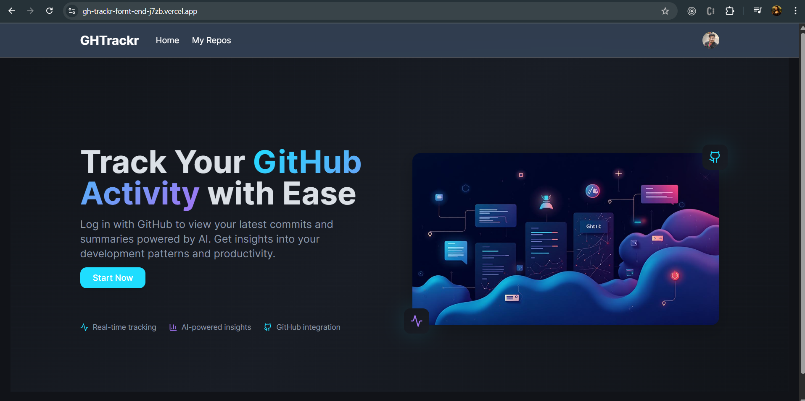
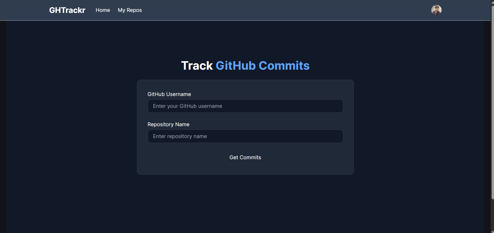
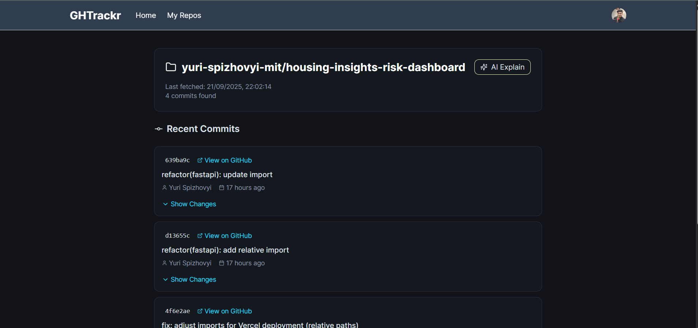
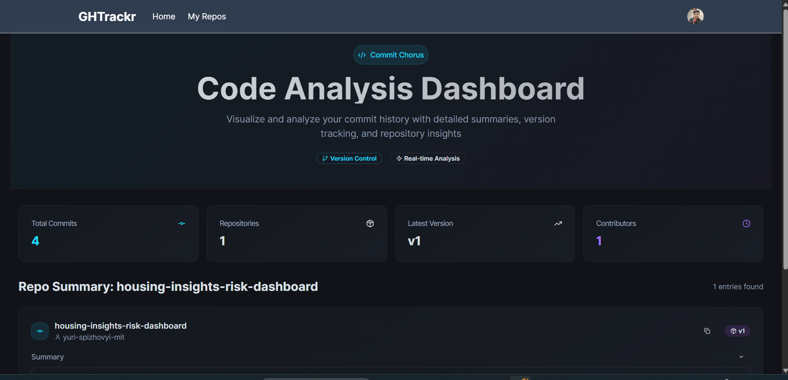
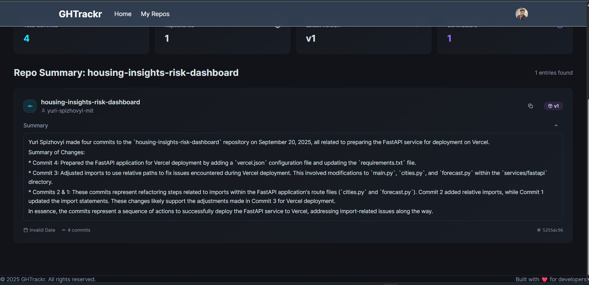

# GH-TRACKR

# 🚀 TRACKR

TRACKR is a web app that fetches **yesterday’s GitHub commits** from your repositories and generates a smart **AI-powered summary** using **Google Gemini**.  
It helps developers stay on top of their daily progress without manually scanning commit logs.

---

## ✨ Features
- 🔍 Automatically fetches **yesterday’s commits** from GitHub.
- 🤖 Uses **Gemini AI** to generate concise, human-like summaries.
- 📊 Stores commit history in a database for quick access.
- 🌐 Simple, clean UI built with React.js.

---

## 📸 Screenshot

- Clicke Start Now  

---

- add your Github UserName and yester day commited  Repo Name. 

- Click Get Commits

---

- If Get your Commits you come here in this page you Can see you all Commits and than you can genrate you commit Summary.

- Now Click AI Explan Button

---

- you are come in dashboard.
---

## Clone the repo
git clone https://github.com/harshad00/GHTrackrForntEnd.git

### Go into project folder
cd GHTrackrForntEnd

## Install dependencies
npm install

## Setup environment variables
cp .env.example .env

## Run the app
npm run dev

## BackEnd Repo 

https://github.com/harshad00/GithubProject
